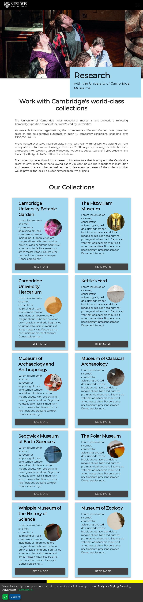

# University of Cambridge Museums Research Hub

This repository contains the code that powers a Jekyll site for the
University of Cambridge Museums Group research hub. This will be maintained (content) by Jo Vine, Jo McPhee and Hannah Price. Code by @portableant



## To run on your local machine

Install Jekyll on your machine following these [instructions](https://jekyllrb.com/docs/installation/)
Install Git on your machine following these [instructions](https://git-scm.com/book/en/v2/Getting-Started-Installing-Git)

Clone the code for this repository: git clone https://github.com/UniversityofCambridgeMuseums/research-hub.git research-hub

Change to the directory and then run this command in terminal:

```bash
 bundle exec jekyll serve
```

## Credits
Copyright the University of Cambridge unless noted otherwise.

Website by @portableant

CSS framework: http://daemonite.github.io/material/

## License
AGPL for code, CC-BY for content (text and images) unless stated otherwise.

## Contributing guidelines
If you want to contribute fixes to this site, you are very welcome to do so. To do this, either add a bug report under issues or fork the repository and create a new branch for proposed fixes and then submit a pull request.
